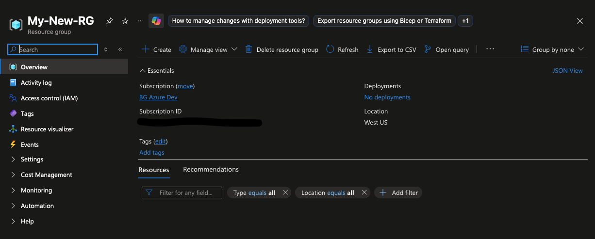

## What the heck is Terraform?

Terraform is a tool that lets you write code to define and manage resources across a variety of systems and applications. Terraform is what is known in the industry as Infrastructure as Code, or IaC for short.

What Terraform allows you to do is declare the resources you want to create via code and then, with a simple command, execute the creation or update of those resources. Sounds simple enough, right? Defining the infrastructure you are building gives you a blueprint of what you've built and lets you reuse it to build new versions of the same thing. There are a few details to it, of course, but overall Terraform gives you a way to codify your infrastructure in a way that's visible, auditable, and repeatable.

Terraform works by using what is called a Provider to define what you can create. For example, if you want to create cloud resources in AWS or Azure you would use the AWS or Azure cloud provider. These providers are usually built and supported by the vendors themselves — Azure and AWS both have developers that work on their respective providers. There are also open-source and community-built providers, and you can even build your own custom provider. Building a provider is a bit more complicated, though, so we'll stay away from that.

Now, why would you want to use Terraform? Within each cloud provider portal there is an awful lot you can do, which is fine for someone just starting out. But eventually your cloud footprint may grow to a point where making changes by hand is too time-consuming. Using Terraform you can not only create a blueprint but also use it to structure and plan out your cloud environments. How does it do that? Terraform keeps track of the resources you create using what is called a state file. Terraform state is the source of truth for what you are managing with Terraform — it's essentially a database of your resources and their settings. Without it, you'd just have a bunch of code with no way to verify that you have what you think you have.

Let's dig in and see how this all works.

## Terraform Resource Creation Demo

Let's say I'm working in Azure and I need to create a resource group. Using Terraform, the code looks like this:

```hcl
resource "azurerm_resource_group" "example" {
  name     = "My New RG"
  location = "West US"
}
```

In the first line, `resource` tells Terraform to create an `azurerm_resource_group`. These resource types are defined by the provider — in this case the [AzureRM Terraform Provider](https://registry.terraform.io/providers/hashicorp/azurerm/latest). You can look up all available resource types and their configuration options there.

For Terraform to run, you need the Terraform binary installed. On Windows you'd install `terraform.exe`; on macOS you can run `brew install terraform`. Then from a command line run:

```bash
terraform init
```

This initializes your Terraform files and pulls down the required providers. Once that completes, run:

```bash
terraform plan
```

```diff
Terraform used the selected providers to generate the following execution plan. Resource actions are indicated
with the following symbols:
  + create

Terraform will perform the following actions:

  # azurerm_resource_group.example will be created
  + resource "azurerm_resource_group" "example" {
      + id       = (known after apply)
      + location = "westus"
      + name     = "My-New-RG"
    }

Plan: 1 to add, 0 to change, 0 to destroy.
```

Now we can see that Terraform wants to create a resource group named "My-New-RG" in the West US region of Azure. That `id` showing `(known after apply)` is Terraform telling us it won't know the value until the resource is actually created. Azure assigns a unique Resource ID to every resource within your subscription, and that ID will end up in Terraform state once the resource exists. For now, just know it will be there.

A couple of things to note about the plan output. First, `Plan: 1 to add, 0 to change, 0 to destroy.`

Terraform is telling us it's going to add this resource group to the Azure subscription. What about change and destroy? If you modify something in Terraform, you will sometimes see `X to change` or `X to destroy`. Some resources can be updated in place without too much impact, but others require a delete-and-recreate — something to be careful about as you work with Terraform over time. In the plan output, changes are marked with `~` and deletes with `-`. Adds are green, changes are yellow, and deletes are red, so you always have advance warning of what Terraform is about to do. However, that's not always the full picture of what's changing or being deleted — a topic for another time.

Let's run `terraform apply` in our terminal and create our resource group.

While `terraform apply` is running, what's actually happening? It's essentially just a plan with a yes/no gate. If you type `yes`, Terraform creates what it showed in the plan. Go ahead and type `yes` and it will spin up the resource group in Azure.

```diff
Terraform will perform the following actions:

  # azurerm_resource_group.example will be created
  + resource "azurerm_resource_group" "example" {
      + id       = (known after apply)
      + location = "westus"
      + name     = "My-New-RG"
    }

Plan: 1 to add, 0 to change, 0 to destroy.

Do you want to perform these actions?
  Terraform will perform the actions described above.
  Only 'yes' will be accepted to approve.

  Enter a value: yes

azurerm_resource_group.example: Creating...
azurerm_resource_group.example: Still creating... [10s elapsed]
azurerm_resource_group.example: Creation complete after 12s [id=/subscriptions/<subscription_id>/resourceGroups/My-New-RG]
```

Checking in the portal we can see it is indeed there!



That's a good start for today. Next up, we'll dig into that state file we mentioned and see what's actually inside it.
